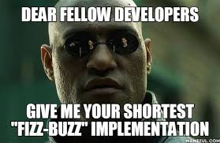

# :shinto_shrine: - Fizz-Buzz+ #

## Introducción ##


La pesadilla de muchos programadores a la hora de enfrentarse a una entrevista de trabajo, quizás debido a su compleja algoritmia, o simplemente debido a su inusual razonamiento. 

Sea como sea, tú seguro que serás capaz de conseguirlo!!

## Requisitos ##
- Variables
- Condicionales
- Bucles

## Iteraciones ##


Imprime todos los números del 1 al 1000 por consola, con la salvedad de todos aquellos números que sean múltiplos de 3 que en vez de imprimir el número, se imprimirá fizz y además, en lugar de los números que sean múltiplos de 5 se imprimirá buzz.

Salida por consola:
```
1
2
Fizz
4
Buzz
6
7
8
Fizz
Buzz
11
Fizz
13
14
FizzBuzz
16
...
```